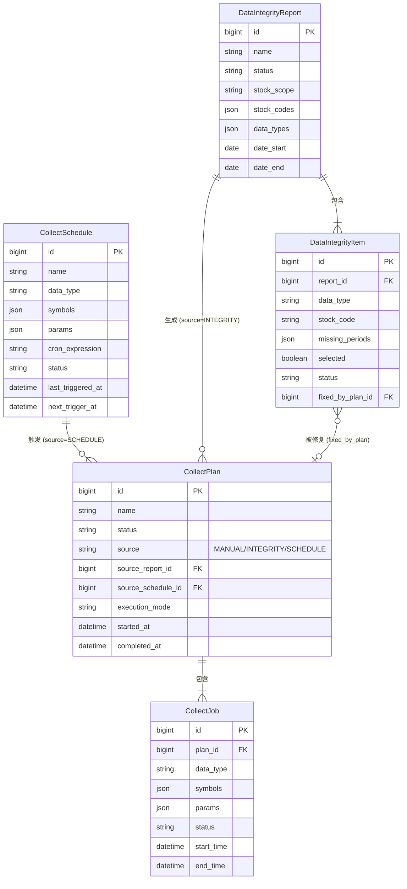
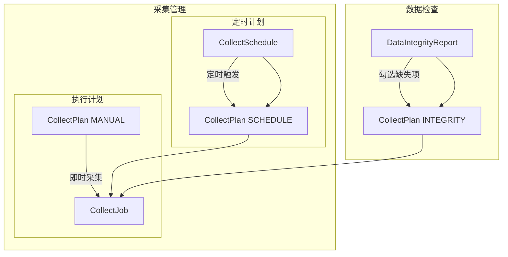

# 数据完整性检查与采集计划设计

## 概述

建立数据完整性检查与采集管理的完整工作流，支持两种采集模式：

### 采集模式

| 模式 | 流程 | 说明 |
|-----|------|------|
| **检查并修复** | 检查 → 报告 → 勾选 → 修复计划 → 执行 | 有目标的修复 |
| **直接采集** | 直接创建计划 → 执行 | 无需检查，直接采 |

### 核心功能

1. 生成数据完整性报告，展示各类数据缺失情况
2. 基于报告勾选缺失项，生成修复计划
3. 配置定时计划，按周期自动采集
4. 手动创建采集计划，即时执行
5. 执行并追踪采集进度

### 概念层次

| 层级 | 概念 | 说明 | 示例 |
|-----|------|------|------|
| 1 | **Schedule** | 定时配置（模板） | "每天9点采集行情" |
| 2 | **Plan** | 执行计划（一次性） | "修复2024年Q1缺失数据" |
| 3 | **Job** | 采集任务（执行单元） | "采集 000001 的行情" |

**关系**：
```
Schedule ──定时触发──→ Plan ──包含──→ 多个 Job
                        ↑
完整性报告 ──手动生成──┘
                        ↑
手动创建 ──即时创建────┘
```

## 数据模型

### CollectSchedule（定时计划）- 新增

定时计划是采集任务的模板配置，按周期自动触发执行。

```python
class CollectSchedule(models.Model):
    STATUS_CHOICES = [
        ('ENABLED', '已启用'),
        ('DISABLED', '已禁用'),
    ]
    
    id = models.BigAutoField(primary_key=True)
    name = models.CharField('计划名称', max_length=200)
    status = models.CharField('状态', max_length=20, choices=STATUS_CHOICES, default='ENABLED')
    
    # 采集配置
    data_type = models.CharField('数据类型', max_length=50)
    symbols = models.JSONField('股票列表', default=list)  # 空列表表示全部股票
    params = models.JSONField('采集参数', default=dict)
    
    # 定时配置
    cron_expression = models.CharField('Cron表达式', max_length=100)  # 如 "0 9 * * 1-5"
    last_triggered_at = models.DateTimeField('上次触发时间', null=True, blank=True)
    next_trigger_at = models.DateTimeField('下次触发时间', null=True, blank=True)
    
    created_at = models.DateTimeField('创建时间', auto_now_add=True)
    updated_at = models.DateTimeField('更新时间', auto_now=True)
    
    class Meta:
        db_table = 'collector_collect_schedule'
        ordering = ['-created_at']
        verbose_name = '定时计划'
        verbose_name_plural = '定时计划'
```

**触发逻辑**：
- Schedule 到期时，自动创建 CollectPlan（`source='SCHEDULE'`）
- CollectPlan 执行时，创建多个 CollectJob

### DataIntegrityReport（数据完整性报告）

```python
class DataIntegrityReport(models.Model):
    STATUS_CHOICES = [
        ('GENERATING', '生成中'),
        ('COMPLETED', '已完成'),
        ('FAILED', '失败'),
    ]
    
    STOCK_SCOPE_CHOICES = [
        ('ALL', '全部股票'),
        ('SELECTED', '选定股票'),
    ]
    
    id = models.BigAutoField(primary_key=True)
    name = models.CharField('报告名称', max_length=200)
    status = models.CharField('状态', max_length=20, choices=STATUS_CHOICES, default='GENERATING')
    stock_scope = models.CharField('股票范围', max_length=20, choices=STOCK_SCOPE_CHOICES, default='ALL')
    stock_codes = models.JSONField('股票列表', default=list)  # stock_scope=SELECTED 时使用
    date_start = models.DateField('开始日期')
    date_end = models.DateField('结束日期')
    created_at = models.DateTimeField('创建时间', auto_now_add=True)
    completed_at = models.DateTimeField('完成时间', null=True, blank=True)
    
    class Meta:
        db_table = 'collector_data_integrity_report'
        ordering = ['-created_at']


class DataIntegrityItem(models.Model):
    STATUS_CHOICES = [
        ('PENDING', '待修复'),
        ('FIXED', '已修复'),
    ]
    
    id = models.BigAutoField(primary_key=True)
    report = models.ForeignKey(DataIntegrityReport, on_delete=models.CASCADE, related_name='items')
    data_type = models.CharField('数据类型', max_length=50)
    stock_code = models.CharField('股票代码', max_length=20)
    missing_periods = models.JSONField('缺失周期', default=list)
    selected = models.BooleanField('已选择', default=False)
    status = models.CharField('修复状态', max_length=20, choices=STATUS_CHOICES, default='PENDING')
    fixed_at = models.DateTimeField('修复时间', null=True, blank=True)
    fixed_by_plan = models.ForeignKey('CollectPlan', on_delete=models.SET_NULL, null=True, blank=True)
    
    class Meta:
        db_table = 'collector_data_integrity_item'
```

### CollectPlan（执行计划）

执行计划是一次性的采集任务集合，可由三种来源创建：

| 来源 | 触发方式 | source 值 |
|-----|---------|----------|
| 手动创建 | 用户即时采集 | `MANUAL` |
| 完整性报告 | 勾选缺失项后生成 | `INTEGRITY` |
| 定时计划 | Schedule 到期触发 | `SCHEDULE` |

```python
class CollectPlan(models.Model):
    STATUS_CHOICES = [
        ('PENDING', '待执行'),
        ('RUNNING', '执行中'),
        ('COMPLETED', '已完成'),
        ('FAILED', '失败'),
    ]
    
    SOURCE_CHOICES = [
        ('MANUAL', '手动创建'),
        ('INTEGRITY', '完整性报告'),
        ('SCHEDULE', '定时计划'),
    ]
    
    EXECUTION_MODE_CHOICES = [
        ('PARALLEL', '并行执行'),
        ('SEQUENTIAL', '顺序执行'),
    ]
    
    id = models.BigAutoField(primary_key=True)
    name = models.CharField('计划名称', max_length=200)
    status = models.CharField('状态', max_length=20, choices=STATUS_CHOICES, default='PENDING')
    
    # 来源追踪
    source = models.CharField('来源', max_length=20, choices=SOURCE_CHOICES, default='MANUAL')
    source_report = models.ForeignKey(DataIntegrityReport, on_delete=models.SET_NULL, null=True, blank=True, related_name='plans')
    source_schedule = models.ForeignKey('CollectSchedule', on_delete=models.SET_NULL, null=True, blank=True, related_name='plans')
    
    # 执行配置
    execution_mode = models.CharField('执行模式', max_length=20, choices=EXECUTION_MODE_CHOICES, default='PARALLEL')
    
    created_at = models.DateTimeField('创建时间', auto_now_add=True)
    started_at = models.DateTimeField('开始时间', null=True, blank=True)
    completed_at = models.DateTimeField('完成时间', null=True, blank=True)
    
    class Meta:
        db_table = 'collector_collect_plan'
        ordering = ['-created_at']
        verbose_name = '执行计划'
        verbose_name_plural = '执行计划'
```

**来源约束**：
- `source='MANUAL'` → `source_report=null`, `source_schedule=null`
- `source='INTEGRITY'` → `source_report` 有值
- `source='SCHEDULE'` → `source_schedule` 有值

### CollectJob（采集任务）

采集任务是最小执行单元，执行单个数据类型的采集。

```python
class CollectJob(models.Model):
    STATUS_CHOICES = [
        ('PENDING', '待执行'),
        ('RUNNING', '执行中'),
        ('SUCCESS', '成功'),
        ('FAILED', '失败'),
    ]
    
    id = models.BigAutoField(primary_key=True)
    
    # 采集配置
    data_type = models.CharField('数据类型', max_length=50)
    symbols = models.JSONField('股票列表', default=list)
    params = models.JSONField('其他参数', default=dict)
    
    # 所属计划（可独立，不归属任何 Plan）
    plan = models.ForeignKey(CollectPlan, on_delete=models.SET_NULL, null=True, blank=True, related_name='jobs')
    
    # 执行状态
    status = models.CharField('状态', max_length=20, choices=STATUS_CHOICES, default='PENDING')
    start_time = models.DateTimeField('开始时间', null=True, blank=True)
    end_time = models.DateTimeField('结束时间', null=True, blank=True)
    message = models.TextField('消息', null=True, blank=True)
    
    created_at = models.DateTimeField('创建时间', auto_now_add=True)
    
    class Meta:
        db_table = 'collector_collect_job'
        ordering = ['-created_at']
```

**Plan 关系**：
- `plan=null`：独立任务（历史遗留，逐步迁移到 Plan 模式）
- `plan` 有值：属于某个执行计划

### 数据模型关系（ER 图）



**关系说明**：

| 关系 | 类型 | 说明 |
|-----|------|------|
| Schedule → Plan | 1:N | 定时计划多次触发，生成多个执行计划 |
| Report → Plan | 1:N | 一个报告可生成多个修复计划 |
| Report → Item | 1:N | 一个报告包含多个缺失项 |
| Item → Plan | N:1 | 缺失项被某个计划修复（可选） |
| Plan → Job | 1:N | 一个计划包含多个采集任务 |

**CollectPlan 的三种来源**：

| source | 来源 | 外键 |
|--------|------|------|
| MANUAL | 手动即时采集 | source_report_id=null, source_schedule_id=null |
| INTEGRITY | 完整性报告修复 | source_report_id 有值 |
| SCHEDULE | 定时计划触发 | source_schedule_id 有值 |

**数据流**：



## API 设计

### DataIntegrityReport API

| 方法 | 路径 | 说明 |
|-----|------|------|
| POST | `/api/integrity-reports/` | 创建并开始生成报告 |
| GET | `/api/integrity-reports/` | 列出历史报告 |
| GET | `/api/integrity-reports/{id}/` | 获取报告详情（含 items） |
| PATCH | `/api/integrity-reports/{id}/items/` | 批量更新 selected 状态 |
| POST | `/api/integrity-reports/{id}/items/select-all/` | 全选/取消全选（支持筛选） |
| POST | `/api/integrity-reports/{id}/generate-plan/` | 从报告生成 CollectPlan |
| POST | `/api/integrity-reports/{id}/refresh/` | 刷新报告（重新检查数据） |

**报告生成参数**（POST 请求体）：

```json
{
  "name": "2024年Q4完整性检查",
  "stock_scope": "all" | "selected",
  "stock_codes": ["000001", "000002"],  // stock_scope=selected 时必填
  "date_start": "2024-01-01",
  "date_end": "2024-12-31"
}
```

**进度轮询机制**：
- 前端创建报告后，每 3 秒轮询 `GET /api/integrity-reports/{id}/`
- 根据 `status` 字段判断是否完成
- 完成后停止轮询，展示报告详情

### CollectSchedule API

| 方法 | 路径 | 说明 |
|-----|------|------|
| POST | `/api/collect-schedules/` | 创建定时计划 |
| GET | `/api/collect-schedules/` | 列出定时计划 |
| GET | `/api/collect-schedules/{id}/` | 获取定时计划详情 |
| PATCH | `/api/collect-schedules/{id}/` | 编辑定时计划 |
| DELETE | `/api/collect-schedules/{id}/` | 删除定时计划 |
| POST | `/api/collect-schedules/{id}/toggle/` | 启用/禁用定时计划 |
| POST | `/api/collect-schedules/{id}/trigger/` | 手动触发（立即执行一次） |

**创建参数**（POST 请求体）：

```json
{
  "name": "每日行情采集",
  "data_type": "historical_quote",
  "symbols": [],  // 空数组表示全部股票
  "params": {
    "date_start": "today",
    "date_end": "today"
  },
  "cron_expression": "0 9 * * 1-5"
}
```

### CollectPlan API

| 方法 | 路径 | 说明 |
|-----|------|------|
| POST | `/api/collect-plans/` | 创建执行计划（即时采集） |
| GET | `/api/collect-plans/` | 列出执行计划 |
| GET | `/api/collect-plans/{id}/` | 获取计划详情 |
| PATCH | `/api/collect-plans/{id}/` | 编辑计划（仅 PENDING 状态） |
| POST | `/api/collect-plans/{id}/execute/` | 开始执行计划 |
| DELETE | `/api/collect-plans/{id}/` | 删除计划（仅 PENDING 状态） |

**即时采集参数**（POST 请求体）：

```json
{
  "name": "即时采集-行情",
  "source": "MANUAL",
  "jobs": [
    {
      "data_type": "historical_quote",
      "symbols": ["000001", "000002"],
      "params": {
        "date_start": "2024-01-01",
        "date_end": "2024-12-31"
      }
    }
  ]
}
```

## 前端页面

### 模块定义

系统分为4个核心模块：

| 模块 | 说明 | 子功能 |
|-----|------|--------|
| 仪表盘 | 数据概览 | 完整度热力图、数据统计 |
| 数据浏览 | 查看已有数据 | 按股票浏览、按类型浏览 |
| 数据检查 | 数据完整性检查 | 完整性报告 |
| 采集管理 | 数据采集管理 | 定时计划、执行计划 |

### 导航栏结构

```
├── 仪表盘
│   └── 热力图 + 数据统计概览
├── 数据浏览
│   ├── 按股票浏览
│   └── 按类型浏览
├── 数据检查
│   └── 完整性报告列表 + 新建报告
└── 采集管理
    ├── 定时计划（Schedule 列表 + 新建/编辑）
    └── 执行计划（Plan 列表 + 状态追踪 + 即时采集入口）
```

### 页面路由

| 路由 | 模块 | 说明 |
|-----|------|------|
| `/` | 仪表盘 | 热力图 + 统计概览 |
| `/data-browse/stock` | 数据浏览 | 按股票浏览数据 |
| `/data-browse/type` | 数据浏览 | 按类型浏览数据 |
| `/integrity-reports` | 数据检查 | 报告列表 + 新建 |
| `/integrity-reports/{id}` | 数据检查 | 报告详情 |
| `/collect-schedules` | 采集管理 | 定时计划列表 |
| `/collect-schedules/new` | 采集管理 | 新建定时计划 |
| `/collect-schedules/{id}/edit` | 采集管理 | 编辑定时计划 |
| `/collect-plans` | 采集管理 | 执行计划列表 + 即时采集入口 |
| `/collect-plans/{id}` | 采集管理 | 计划详情 |
| `/collect-plans/new` | 采集管理 | 新建执行计划（即时采集） |

### 报告详情页交互

1. 显示各 data_type 分组统计
2. 显示每个缺失项的修复状态（待修复/已修复）
3. 每个缺失项可勾选（仅待修复项可勾选）
4. 支持按状态筛选（全部/待修复/已修复）
5. 底部"生成计划"按钮 → 跳转到计划编辑页，预填充数据
6. "刷新报告"按钮 → 重新检查数据完整性

### 计划详情页交互

1. 显示计划状态和进度
2. 显示各 CollectJob 执行状态
3. PENDING 状态可编辑、执行
4. RUNNING/COMPLETED 状态只读

## 仪表盘功能设计

### 功能概述

仪表盘是系统首页，提供全局数据概览：
1. **完整度热力图**：全周期、全股票、全数据类型的数据完整度可视化
2. **数据统计概览**：各数据类型记录数、日期范围等

### 完整度热力图

**页面布局：**
```
┌─────────────────────────────────────────────────────────┐
│  数据完整度热力图                                        │
│  频度: [月度 ▼]                                          │
├─────────────────────────────────────────────────────────┤
│                                                         │
│              2020-01  2020-02  2020-03  ...  2026-03   │
│  ┌────────────────────────────────────────────────────┐│
│  │ trade_days     ████  ██████  ████      ██████     ││
│  │ stock_info     ███   █████   ████      █████      ││
│  │ quote          ██    ████    ███       ████       ││
│  │ historical_... ███   ███     ████      ███        ││
│  │ balance_sheet  █     ██      ███       ██         ││
│  │ income         █     ██      ███       ██         ││
│  │ cash_flow      █     ██      ███       ██         ││
│  │ dividend       ██    ███     ████      ███        ││
│  │ main_business  ███   ████    ████      ████       ││
│  │ capital        ████  ██████  █████     ██████     ││
│  └────────────────────────────────────────────────────┘│
│                                                         │
│  颜色: 🔴 0% ─────────────────────────── 🟢 100%      │
└─────────────────────────────────────────────────────────┘
```

**交互设计：**
1. 顶部频度下拉选择器：日度 / 周度 / 月度（默认） / 季度 / 年度
2. 热力图使用 ECharts heatmap 组件
3. 颜色渐变：红色(0%) → 黄色(50%) → 绿色(100%)
4. 鼠标悬停显示具体数值（如 "2024-01 | 历史行情 | 完整度: 87%"）
5. 点击单元格可跳转到对应的完整性检查页面

**热力图计算逻辑：**

```
1. 从 saa_trade_days 获取 MIN(date), MAX(date) 确定时间范围
2. 按 frequency 将时间范围划分为 periods
3. 对每个 period × data_type 计算完整度：

   trade_days:
     - 期望: period 内应有交易日数
     - 实际: period 内有数据的交易日数
     - 完整度 = 实际 / 期望

   stock_info / quote (单行类型):
     - 期望: period 内存在的股票数
     - 实际: 有记录的股票数
     - 完整度 = 实际 / 期望

   historical_quote (按日期多行):
     - 期望: period 内交易日数 × 股票数
     - 实际: period 内记录数
     - 完整度 = 实际 / 期望

   balance_sheet / income / cash_flow (按报告期):
     - 期望: period 内应报告期数 × 股票数
     - 实际: period 内记录数
     - 完整度 = 实际 / 期望
```

### 数据统计概览

复用现有 `GET /api/data-status/` 接口，展示：
- 各数据类型记录总数
- 最早/最新日期
- 可选：最近采集任务状态

### 仪表盘 API 设计

**热力图 API：**

```
GET /api/dashboard/completeness-heatmap/?frequency=monthly
```

**请求参数：**

| 参数 | 类型 | 必填 | 说明 |
|-----|------|------|------|
| frequency | string | 否 | 频度：daily/weekly/monthly/quarterly/yearly，默认 monthly |

**返回数据：**

```json
{
  "success": true,
  "data": {
    "date_range": {
      "start": "2020-01-06",
      "end": "2026-03-14"
    },
    "frequency": "monthly",
    "periods": ["2020-01", "2020-02", "2020-03", ..., "2026-03"],
    "data_types": [
      {"key": "trade_days", "label": "交易日"},
      {"key": "stock_info", "label": "股票基本信息"},
      {"key": "quote", "label": "最新行情"},
      {"key": "historical_quote", "label": "历史行情"},
      {"key": "balance_sheet", "label": "资产负债表"},
      {"key": "income", "label": "利润表"},
      {"key": "cash_flow", "label": "现金流量表"},
      {"key": "dividend", "label": "分红数据"},
      {"key": "main_business", "label": "主营业务"},
      {"key": "capital", "label": "股本变动"}
    ],
    "matrix": {
      "trade_days": [0.95, 1.0, 0.88, ...],
      "stock_info": [0.92, 0.95, 0.90, ...],
      "quote": [0.88, 0.91, 0.87, ...],
      "historical_quote": [0.85, 0.89, 0.92, ...],
      ...
    }
  }
}
```

**性能说明：**
- 当前采用实时计算方案
- 后续可优化为定时预计算 + 缓存

## 数据浏览功能设计

### 功能概述

数据浏览模块提供两种浏览入口：
1. **按股票浏览**：选择股票 → 查看该股票所有数据类型
2. **按类型浏览**：选择数据类型 → 查看所有股票该类型数据

### 支持的数据类型

| 数据类型 | 说明 | 表结构 |
|---------|------|--------|
| stock_info | 股票基本信息 | 单行（每股票一条） |
| quote | 最新行情 | 单行（每股票一条） |
| historical_quote | 历史行情 | 多行（每股票多条，按日期） |
| trade_days | 交易日 | 多行（全局数据） |
| balance_sheet | 资产负债表 | 多行（每股票多条，按报告期） |
| income | 利润表 | 多行（每股票多条，按报告期） |
| cash_flow | 现金流量表 | 多行（每股票多条，按报告期） |
| dividend | 分红数据 | 多行（每股票多条） |
| main_business | 主营业务 | 多行（每股票多条） |
| capital | 股本变动 | 多行（每股票多条） |
| valuation | 估值数据 | 多行（每股票多条，按日期） |

### 按股票浏览页面设计

**页面布局：**
```
┌─────────────────────────────────────────────────────────┐
│  数据浏览 - 按股票                              [按类型] │
├─────────────────────────────────────────────────────────┤
│ ┌─────────────┐ ┌─────────────────────────────────────┐ │
│ │ 搜索/筛选   │ │ Tab: 基本信息 | 行情 | 财务报表 | ... │ │
│ │ [________]  │ ├─────────────────────────────────────┤ │
│ │             │ │                                     │ │
│ │ 股票列表    │ │        当前 Tab 的数据表格          │ │
│ │ 000001 平安 │ │                                     │ │
│ │ 000002 万科 │ │   （分页、排序、筛选）              │ │
│ │ 000003 ...  │ │                                     │ │
│ │             │ │                                     │ │
│ │ [加载更多]  │ │                                     │ │
│ └─────────────┘ └─────────────────────────────────────┘ │
└─────────────────────────────────────────────────────────┘
```

**交互流程：**
1. 左侧显示股票列表（支持搜索、分页）
2. 点击股票 → 右侧加载数据
3. 右侧 Tab 切换数据类型
4. 表格支持排序、筛选、分页

**API 设计：**
```
GET /api/stocks/?search=000001&page=1&page_size=50
GET /api/stocks/{symbol}/stock-info/
GET /api/stocks/{symbol}/quote/
GET /api/stocks/{symbol}/historical-quotes/?page=1&page_size=100
GET /api/stocks/{symbol}/balance-sheets/?page=1&page_size=50
GET /api/stocks/{symbol}/income/?page=1&page_size=50
GET /api/stocks/{symbol}/cash-flows/?page=1&page_size=50
GET /api/stocks/{symbol}/dividends/?page=1&page_size=50
GET /api/stocks/{symbol}/main-business/?page=1&page_size=50
GET /api/stocks/{symbol}/capital/?page=1&page_size=50
GET /api/stocks/{symbol}/valuation/?page=1&page_size=50
```

### 按类型浏览页面设计

**页面布局：**
```
┌─────────────────────────────────────────────────────────┐
│  数据浏览 - 按类型                              [按股票] │
├─────────────────────────────────────────────────────────┤
│ 数据类型: [历史行情 ▼]  日期范围: [____] - [____]       │
├─────────────────────────────────────────────────────────┤
│                                                         │
│                    AG Grid 数据表格                     │
│                                                         │
│  股票代码 | 日期 | 开盘 | 最高 | 最低 | 收盘 | 成交量  │
│  --------|------|------|------|------|------|-------- │
│  000001  | ...  | ...  | ...  | ...  | ...  | ...     │
│  000002  | ...  | ...  | ...  | ...  | ...  | ...     │
│                                                         │
│                    [分页控件]                           │
└─────────────────────────────────────────────────────────┘
```

**交互流程：**
1. 顶部选择数据类型（下拉框）
2. 可选：设置筛选条件（日期范围、股票代码等）
3. 下方表格展示所有股票的该类型数据
4. 表格支持排序、筛选、分页、导出

**API 设计：**
```
GET /api/data-browse/historical-quotes/?page=1&page_size=100&sort=-date
GET /api/data-browse/balance-sheets/?page=1&page_size=100&report_period=2024-Q3
GET /api/data-browse/trade-days/?page=1&page_size=100
...
```

### 表格展示设计

**不同数据类型的列定义：**

**历史行情（historical_quote）：**
| 字段 | 说明 |
|-----|------|
| stock_code | 股票代码 |
| trade_date | 交易日期 |
| open | 开盘价 |
| high | 最高价 |
| low | 最低价 |
| close | 收盘价 |
| volume | 成交量 |
| amount | 成交额 |

**资产负债表（balance_sheet）：**
| 字段 | 说明 |
|-----|------|
| stock_code | 股票代码 |
| report_period | 报告期 |
| report_date | 报告日期 |
| total_assets | 资产总计 |
| total_liabilities | 负债合计 |
| total_equity | 所有者权益合计 |
| ... | （更多财务科目） |

**其他数据类型类似，根据实际表结构定义**

## 执行机制

### Schedule 定时触发

```
Celery beat 定时投递扫描任务
    │
    ├── scheduler worker 遍历所有 enabled 的 CollectSchedule
    │
    └── 到达触发时间
            │
            ├── 创建 CollectPlan
            │       ├── source = 'SCHEDULE'
            │       ├── source_schedule = schedule
            │       └── 根据 schedule 配置生成 jobs
            │
            └── 自动执行 CollectPlan
```

### Plan 执行流程（统一入口）

```
POST /api/collect-plans/{id}/execute/
    │
    ├── 检查 status = PENDING
    ├── 更新 status = RUNNING
    ├── 记录 started_at
    │
    ├── execution_mode = PARALLEL
    │       └── 并发执行所有 jobs（threading）
    │
    └── execution_mode = SEQUENTIAL
            └── 按顺序执行 jobs

每个 CollectJob 执行：
    └── CollectJobExecutor
            └── 复用现有 BaseCollectView 逻辑

执行完成后：
    ├── 更新 CollectPlan 状态
    │
    └── 如果 source = 'INTEGRITY'
            └── 自动更新关联报告中的缺失项状态
```

### 长任务拆分与恢复约束

`CollectPlan` 和 `CollectJob` 是当前前端可见的管理单元。Celery task id 只用于队列追踪，不应直接成为用户必须理解或操作的对象。对于 `financial_statements` 这类 5000+ symbols、单次可能运行 30 小时以上的长任务，后端可以把一个 `CollectJob` 内部拆成多个 Celery chunk task 执行，但前端仍默认展示原来的 Plan/Job 层级。

拆分后的内部执行必须满足两个目标：

- **内存回收**：每个 chunk 作为独立 Celery task 结束后，worker 子进程可以通过 `max-tasks-per-child` 或 `max-memory-per-child` 回收，避免单个超长 task 在 5000+ symbols 内持续累计 RSS。
- **失败续跑**：执行状态不能只保存在进程内存或日志中。系统需要持久化记录未完成的 symbol 或 chunk；任务中断、worker 重启或某个 chunk 失败后，重新执行同一个 job 时应只处理 `remaining_symbols` 或未完成 chunk，避免整批 30 小时任务从头开始。

推荐的用户可见语义：

- 用户仍看到一个 `CollectJob(data_type='financial_statements')`。
- chunk 作为内部执行细节，可写入独立进度表、`job.config.remaining_symbols`，或后续专门的 job progress 模型。运行完成后应清理临时进度字段，避免长期保存 5000+ 个已完成 symbol。
- 所有 chunk 成功后，原 `CollectJob` 才标记为 `SUCCESS`。
- 任一 chunk 最终失败时，原 `CollectJob` 标记为 `FAILED`，message 中应包含失败 symbol/chunk 摘要，便于下次恢复执行和人工排查。
- 重新执行 `FAILED` job 时优先走恢复逻辑，不应默认清空已成功进度。

### 修复反馈机制

当 CollectPlan 执行完成后（所有 jobs 成功），自动更新关联报告的缺失项状态：

```
计划完成
    │
    ├── 检查 source_report 是否存在
    │
    └── 遍历成功的 jobs
            │
            └── 对于每个 job：
                    ├── 匹配报告中的 DataIntegrityItem（data_type + stock_code）
                    ├── 更新 status = 'FIXED'
                    ├── 记录 fixed_at = now()
                    └── 记录 fixed_by_plan = plan
```

**更新逻辑：**
- 只更新 `status='PENDING'` 的项
- 按 `data_type` 和 `stock_code` 匹配
- 所有成功完成的 job 对应的缺失项都会被标记为"已修复"

### 报告刷新机制

用户可手动触发报告刷新（`POST /api/integrity-reports/{id}/refresh/`）：

```
刷新报告
    │
    ├── 清空所有 items
    ├── 重置 status = 'GENERATING'
    │
    └── 重新执行完整性检查
            └── 生成新的 items（status 默认为 PENDING）
```

### 任务合并机制

从报告生成计划时，按数据类型合并缺失项：

```
报告缺失项：
    ├── 000001 - quote
    ├── 000002 - quote
    └── 000003 - quote
    │
    └── 合并为 1 个 CollectJob
            └── data_type='quote', symbols=['000001', '000002', '000003']
```

**合并逻辑：**
- 同一 `data_type` 的所有缺失项 → 合并为 1 个 job
- job.symbols = 该 data_type 下所有缺失项的 stock_code 集合
- job.params.date_start/end = 该 data_type 下所有缺失周期的范围

### 与现有代码集成

1. **抽取 CollectJobExecutor service**
   - 从 `BaseCollectView` 抽取执行逻辑
   - 接收 CollectJob 实例，执行采集

2. **CollectPlan 执行器**
   - 调用 CollectJobExecutor 执行每个 job
   - 根据 execution_mode 决定并行或顺序

3. **现有手动触发 API**
   - 保持不变，仍可直接创建独立 CollectJob

## 与现有组件关系

| 现有组件 | 新设计中的角色 |
|---------|--------------|
| Celery beat + scheduler worker | 周期扫描 CollectSchedule，并将到期计划派发到采集队列 |
| views.py 中的 Collect*View | 保持不变，兼容现有手动触发 |
| CompoundServiceFactory | 被 CollectJobExecutor 复用 |
| CollectJob 模型 | 扩展 plan 外键，向后兼容 |

## 实现步骤

### 阶段一：数据模型

1. 创建 DataIntegrityReport、DataIntegrityItem 模型 ✅
2. 创建 CollectPlan 模型（添加 source 字段）✅
3. 创建 CollectSchedule 模型
4. 扩展 CollectJob 模型（添加 plan 外键）✅
5. 执行数据库迁移

### 阶段二：后端 API

1. 实现 DataIntegrityReport API（含刷新报告接口）✅
2. 实现 CollectPlan API ✅
3. 实现 CollectSchedule API
4. 抽取 CollectJobExecutor service
5. 实现计划执行逻辑（含修复反馈机制）✅
6. 实现任务合并逻辑 ✅
7. 实现 Schedule 定时触发逻辑

### 阶段三：前端页面重构

**Task 0: 实现仪表盘**
- 热力图组件（ECharts heatmap）
- 频度切换功能
- 数据统计概览展示

**Task 1: 更新导航栏结构**
- 按4模块定义重构导航
- 去掉"快速检查"，统一到完整性报告
- 去掉独立"即时采集"，整合到执行计划

**Task 2: 重构数据检查页面**
- 报告列表 + 新建按钮
- 报告详情页 ✅

**Task 3: 重构采集管理页面**
- 定时计划列表 + 新建/编辑
- 执行计划列表 + 即时采集入口
- 计划详情页、编辑页 ✅

**Task 4: 实现数据浏览 - 按股票**
- 左侧：股票搜索/列表
- 右侧：数据类型 Tab + 表格展示

**Task 5: 实现数据浏览 - 按类型**
- 顶部：数据类型选择器
- 下方：AG Grid 表格展示

**Task 6: 实现仪表盘和数据浏览 API**
- 热力图 API
- 各数据类型的浏览 API
- 支持分页、排序、筛选

### 阶段四：集成测试

1. 仪表盘功能测试（热力图各频度、数据统计）
2. 完整工作流测试
3. 并行/顺序执行测试
4. 修复反馈机制测试
5. 数据浏览功能测试
6. 定时计划触发测试
7. 与现有功能兼容性测试
